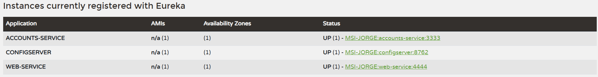
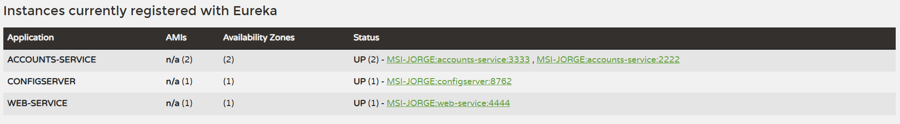
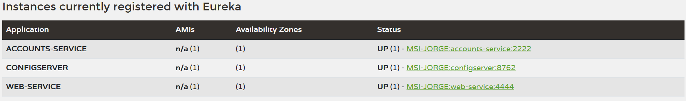
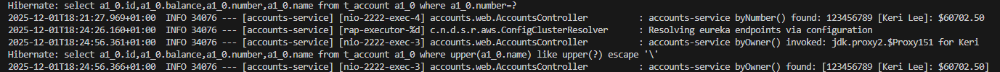

# Lab 6 Microservices - Project Report

# Github repository

https://github.com/jorge2977/lab6-microservices

## 1. Configuration Setup

**Configuration Repository**: [Link to your forked repository]

Describe the changes you made to the configuration:

- What did you modify in `accounts-service.yml`?
In 'config/config/accounts-service.yml', I changed the server port to 2222.
This allows the accounts service to run on a different port than the default 3333.
- Why is externalized configuration useful in microservices?
Externalized configuration allows to change parameters without recompiling the microservice. It also keeps the configuration centralized, it also updates the services dynamically when the configuration changes, improving flexibility and maintainability.

---

## 2. Service Registration (Task 1)

### Accounts Service Registration

Explain what happens during service registration.

- The service loads its configuration from the Config Server.
- It sends a heartbeat to the Eureka server to register itself.
- Eureka returns a confirmation that the service is registered successfully.
- the service is now available for discovery by other services.

### Web Service Registration

Explain how the web service discovers the accounts service.
The web service uses the Eureka client that periodically queries the Eureka server for available services.
When it needs to call the accounts service, it looks up the service registry in Eureka to find the current instances of the accounts service.
It gets the list of available instances and uses Spring Cloud LoadBalancer to distribute requests among them.

---

## 3. Eureka Dashboard (Task 2)

Describe what the Eureka dashboard shows:

- Which services are registered?
ACCOUNTS-SERVICE and WEB-SERVICE are registered.
- What information does Eureka track for each instance?
Eureka tracks the Hostname/IP, Port, Status, heartbeat timestamp, time from last heartbeat, id of the instance and url for health checks.

---

## 4. Multiple Instances (Task 4)

Answer the following questions:

- What happens when you start a second instance of the accounts service?
The second instance also registers itself with Eureka, and both instances are listed in the Eureka dashboard with the same service name.
- How does Eureka handle multiple instances?
Eureka keeps a list of all instances for each service, allowing clients to discover and load balance requests across them.
- How does client-side load balancing work with multiple instances?
Web Service uses Spring Cloud LoadBalancer to distribute requests among the available instances of the accounts service, improving availability and scalability.

---

## 5. Service Failure Analysis (Task 5)

### Initial Failure

Describe what happens immediately after stopping the accounts service on port 3333.
- The web service sends requests to the failed accounts service.
- They can appear as timeouts or connection refused errors.
- Eureka still lists the instance as UP until it misses heartbeats.

### Eureka Instance Removal

Explain how Eureka detects and removes the failed instance:

- How long did it take for Eureka to remove the dead instance?
It took approximately 90 seconds for Eureka to remove the dead instance after it stopped receiving heartbeats.
- What mechanism does Eureka use to detect failures?
Eureka uses a heartbeat mechanism, when it stops receiving heartbeats from an instance, it marks it as DOWN and eventually removes it from the registry after a certain timeout period.

---

## 6. Service Recovery Analysis (Task 6)

Answer the following questions:

- Why does the web service eventually recover?
The web service recovers because once the accounts service is restarted, it re-registers with Eureka.
- How long did recovery take?
Recovery took about 30 seconds after the accounts service was restarted and re-registered with Eureka.
- What role does client-side caching play in the recovery process?
Client-side caching allows the web service to temporarily store the list of available instances.
When the accounts service goes down, the web service can still use the cached information for a short period.

---

## 7. Conclusions

Summarize what you learned about:

- Microservices architecture
I learned that microservices are executed as independent services that communicate over a network. The architecture allows for better scalability, flexibility, and maintainability.
- Service discovery with Eureka
I learned that Eureka is essential for service discovery in microservices. The instances register and the heartbeat mechanism allows a reliable ecosystem.
- System resilience and self-healing
I learned that the system recovers automatically when a service goes down. The clients adjust their cache and select invalid instances whitout manual intervention.
- Challenges you encountered and how yo
u solved them
To revise the logs carefully to understand the registration and failure detection process.

---

## 8. AI Disclosure

**Did you use AI tools?** (ChatGPT, Copilot, Claude, etc.)

- If YES: Which tools? What did they help with? What did you do yourself?
- If NO: Write "No AI tools were used."
Write "No AI tools were used.

**Important**: Explain your own understanding of microservices patterns and Eureka behavior, even if AI helped you write parts of this report.
Euroka checks the health of services through heartbeats, and clients use Eureka to discover services dynamically. If an instance fails, Eureka removes it from the registry after missing heartbeats, and clients adjust their cached data accordingly. This is useful to avoid having an extern load balancer entirely. This design also improves the tolerance, the clients may use the last version cached if Eureka becomes unavailable. All of this forms a robust foundation for microserices communication.

---

## Additional Notes

Any other observations or comments about the assignment.

